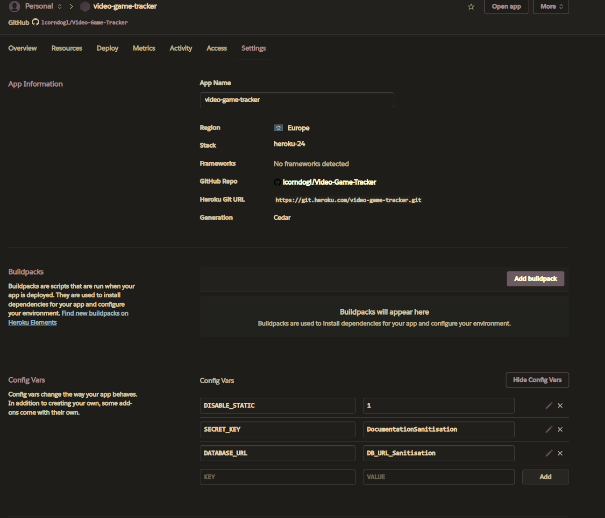

<!-- TODO:
Security
-Allauth
-Defensive Design
-CSRF Tokens

CRUD

Project Setup:

Project setup
```
pip install Django~=4.2.1
pip3 install dj-database-url~=0.5 psycopg2
pip3 install gunicorn~=20.1
pip3 freeze --local > requirements.txt
django-admin startproject videoGameTracker .
echo "web: gunicorn videoGameTracker.wsgi" > Procfile
echo 'import os
os.environ["DATABASE_URL"]=""
os.environ["SECRET_KEY"]="nananana"
os.environ["DEBUG"]=1' > env.py
echo "
env.py" >> .gitignore
python3 manage.py migrate
python3 manage.py runserver

Adjust allowed hosts
CSRF_TRUSTER_ORIGINS
python3 manage.py startapp <<appname>>
Add to installed apps

Create DB & add to config vars

Heroku:
Add config vars
Link to github
check eco dinos are on

```

EZGif Convertor: https://ezgif.com/
-->

# Video Gaming Tracker
<!-- TODO: Update to heroku url -->
## [Link to Live Site](https://video-game-tracker-f52ca7e7c2d0.herokuapp.com)

## Contents
<!-- TODO: AI this  -->
## Introduction

###### [*Back to contents*](#contents)
<!-- TODO: -->
## User Experience

###### [*Back to contents*](#contents)

### Stories

###### [*Back to contents*](#contents)

#### External User Story
<!-- TODO:  -->
###### [*Back to contents*](#contents)

#### Site Owner User Story
<!-- TODO: -->
###### [*Back to contents*](#contents)

### Strategy
<!-- TODO: -->

#### Agile

###### [*Back to contents*](#contents)

#### MoSCoW

###### [*Back to contents*](#contents)

### Scope
<!-- TODO: 
-->

###### [*Back to contents*](#contents)

### Wireframes

###### [*Back to contents*](#contents)

#### Home Wireframe


###### [*Back to contents*](#contents)

#### Profiles Wireframe


###### [*Back to contents*](#contents)

#### User Profiles Wireframe


###### [*Back to contents*](#contents)

#### Sign up Wireframe


###### [*Back to contents*](#contents)

#### Login Wireframe


###### [*Back to contents*](#contents)

#### Logout Wireframe


###### [*Back to contents*](#contents)

#### Edit Profile Wireframe

##### Logged In View


###### [*Back to contents*](#contents)

##### Logged Out View


###### [*Back to contents*](#contents)

#### Mobile / Tablet / Desktop breakpoints
<!-- TODO: 
-->

###### [*Back to contents*](#contents)

## Design

###### [*Back to contents*](#contents)

### Colour Scheme
<!-- TODO: 
 -->

### Imagery
<!-- TODO: find out where images come from -->
<!-- The imagery used in this project has been acquired from xyz -->

###### [*Back to contents*](#contents)

### Typography

The typography I have used Google Fonts, I have searched on there and imported fonts that I think will add to the overall vision of the project, to round it out nicely for a better user experience.

###### [*Back to contents*](#contents)

## Website Features

###### [*Back to contents*](#contents)

### Home

When a user loads the site, a homepage is displayed, this page has a logo, site title & navbar, along with a brief overview of what is available with and without an account.

###### [*Back to contents*](#contents)

### Profiles

A page that is accessible by all, it allows to view all existing users who have marked their profile as public - being accessible without needing to be logged in

### Sign Up

#### Logged In

A page showing which account the user is signed in to, along with buttons to either go to the Home page, or Logout

#### Logged Out

A page showing the sign up form, allowing a user to sign up to the website

### Log In

#### Logged In

A page showing which account the user is signed in to, along with buttons to either go to the Home page, or Logout

#### Logged Out

A page showing a form to sign into a created account, allowing users to sign into their account on the website

### Log Out

#### Logged Out

A page showing a form to sign into a created account, allowing users to sign into their account on the website

#### Logged In

A page showing a page with the options to either go to the Home page, or confirm Logging out of the account

### Edit Profile

#### Logged In

TODO:

#### Logged Out

A page informing that they must be logged in to edit their profile, provides a pair of buttons that redirect the user to either the Home page, or the Sign In Login Page

## Future Features
<!-- TODO: -->

###### [*Back to contents*](#contents)

## Technologies Used

###### [*Back to contents*](#contents)

### HTML Language

HTML is used as the base to the project, utilising [*Django*](#django) to piece the files together to dynamically serve the webpages to the user depending on if they are loggined in or not, as well as the actions they are performing.

###### [*Back to contents*](#contents)

### CSS Styling

CSS is used to provide style to the website to make it more visually appealing to the user of the website. I have also utilised [*Bootstrap*](#bootstrap) as part of the CSS Styling.

###### [*Back to contents*](#contents)

### bash terminal

I used bash as my terminal of choice, using it for various things from setting alias' for commonly used commands, creating directories and files, as well as interfacing with git to add, commit and push to [*GitHub*](#github).

###### [*Back to contents*](#contents)

### Bootstrap

I have utilised boostrap to provide a template for numerous IDs and classes for the formatting of the project.

###### [*Back to contents*](#contents)

### Django

Django framework has been used to dynamically load views and models via Django Template Language (DTL) based on if a user is logged in or not, as well as adding/removing entries from a database in a secure way and protecting from malicious attacks via backend server processing

###### [*Back to contents*](#contents)

### Git

Git has been used to allow for easy versioning of the project, as well as tracking changes which may become important for troubleshooting if any errors are introduced as the code is developed

### GitHub

GitHub has been used as a central repository where the code can be accessed online. It has also been linked to heroku allowing heroku to fetch the repository from GitHub to deploy the project into an online environment, as well as testing the project both locally and online as it is developed to ensure consistent behaviours

###### [*Back to contents*](#contents)

### Gitpod

Gitpod has been used as a remote workspace, allowing for a sandboxed environment where variables can be controlled to ensure no conflicts with other software that may be installed on my personal device

###### [*Back to contents*](#contents)

### Heroku

Heroku has been used to provide the back end processing of the project, allowing it to run Django and generate the HTML of the pages that the user is requesting dynamically

###### [*Back to contents*](#contents)

### Postgres

Data has been stored within a Postgres database that has been provided by [*CodeInstitute*](#codeinstitute).

###### [*Back to contents*](#contents)

### Visual Studio Code

Visual Studio Code has been used to create the project as a pseudo-IDE, allowing for the use of emmet commands to help create the code in an efficient manner, as well as CoPilot integration

###### [*Back to contents*](#contents)

### CoPilot

CoPilot has been used as the AI tool in this project, utilising it for both helping with code creation such as pulling bootstrap templates into the code rather than using a search engine and the documentation where possible. It has also been used to help troubleshoot any errors within the code, and helping with getting the layout of the project correct in places where I may have struggled without it.

###### [*Back to contents*](#contents)

## Deployment

1) Add the required files to the git repository with the command `git add .`
2) Commit the changes to the repository with the command commit command `git commit -m "Final project commit"`

3) [Create new app on Heroku](https://dashboard.heroku.com/new-app)


4) Connect to GitHub repo


5) Set Config vars to replicate what is in env.py - heroku-config-vars.png
link to github



6) Manual deploy on heroku - heroku-deploy.png


7) Check project deployed as expected


###### [*Back to contents*](#contents)

## Testing

###### [*Back to contents*](#contents)

### Responsivity Images

###### [*Back to contents*](#contents)
<!-- TODO: Add all pages -->

###### [*Back to contents*](#contents)

### Validation

###### [*Back to contents*](#contents)

#### HTML
<!-- TODO: Add for all pages
 -->

#### CSS
<!-- TODO: Add for all pages
-->

### Lighthouse Scores

###### [*Back to contents*](#contents)

<!-- TODO: Add extra Pages from project-->
## Bugs
<!-- TODO: -->
###### [*Back to contents*](#contents)

## Credits

###### [*Back to contents*](#contents)

### [Bootstrap](https://www.getbootstrap.com) - [Version 5.3.3](https://getbootstrap.com/docs/5.3/getting-started/introduction/)

###### [*Back to contents*](#contents)

### CodeInstitute

###### [*Back to contents*](#contents)

#### Codestar Walkthrough Blog

I have used the content from the Django walkthrough as a guide for creating the project, including it's apps, to have a guide on where to start with the ability to change field names to amend the functionality from a blog post to being a video game tracker!

#### [Postgres Database](#postgres)

###### [*Back to contents*](#contents)

#### Javascript code used to collapse navbar when a link is clicked

```javascript
<script>
    document
        .querySelectorAll(".navbar-collapse .nav-link")
        .forEach((link) => {
            link.addEventListener("click", function (e) {
                let section = document.querySelector(e.target.getAttribute("href"));
                if (section) {
                    e.preventDefault(); // Prevent default anchor click behavior
                    let navbarHeight = document.querySelector(".navbar-toggler").offsetHeight;
                    window.scroll({
                        top: section.offsetTop - navbarHeight, // Adjust for navbar height
                        behavior: "smooth",
                    });
                    document
                        .querySelector(".navbar-collapse")
                        .classList.remove("show"); // Collapse navbar
                }
            });
        });
</script>
```

###### [*Back to contents*](#contents)
<!-- TODO: -->
<!-- ### [Coolors for the colour scheme](https://coolors.co/ebebeb-c2b8b2-197bbd-090c9b-2a2b2a)

###### [*Back to contents*](#contents) -->

### Eraser.io

#### [Diagram GPT](https://www.eraser.io/diagramgpt)

Diagram GPT was used to create my planned ERD using the prompt below
<!-- TODO: Go through the typings to ensure they are correct - also add a public flag to the User Table -->
```
A table called user containing Unique UserID (autoincrementing), username (String), favourite console (String) & favourite game (String)
A tabled called backlog, containing the UserID from the User table as a foreign key, and a game field (String)
A table called completed, containing the UserID from the User table as a foreign key, and a game field (String)
```

<!-- 
TODO:
Any other things I end up using
 -->

### Fonts

###### [*Back to contents*](#contents)
<!-- TODO:
#### [FontName](Font URL)

###### [*Back to contents*](#contents) -->