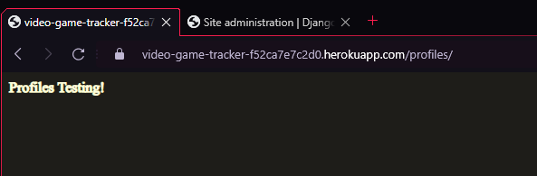
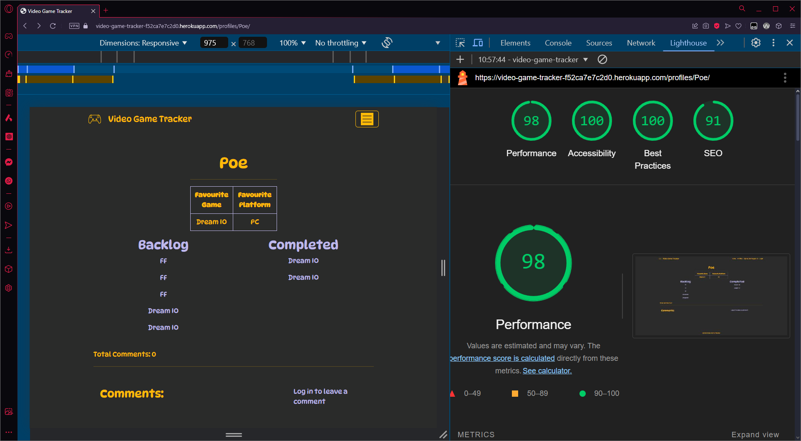
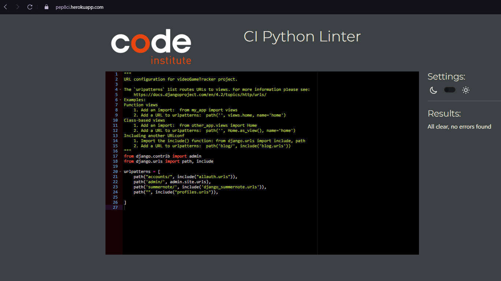

<!-- TODO:
Security
-Allauth
-Defensive Design
-CSRF Tokens

CRUD

Project Setup:

Project setup
```
pip install Django~=4.2.1
pip3 install dj-database-url~=0.5 psycopg2
pip3 install gunicorn~=20.1
pip3 freeze --local > requirements.txt
django-admin startproject videoGameTracker .
echo "web: gunicorn videoGameTracker.wsgi" > Procfile
echo 'import os
os.environ["DATABASE_URL"]=""
os.environ["SECRET_KEY"]="nananana"
os.environ["DEBUG"]=1' > env.py
echo "
env.py" >> .gitignore
python3 manage.py migrate
python3 manage.py runserver

Adjust allowed hosts
CSRF_TRUSTER_ORIGINS
python3 manage.py startapp <<appname>>
Add to installed apps

Create DB & add to config vars

Heroku:
Add config vars
Link to github
check eco dinos are on

```

-->

# Video Gaming Tracker

## [Link to Live Site](https://video-game-tracker-f52ca7e7c2d0.herokuapp.com)

## Contents
<!-- TODO: AI this  -->

## Introduction

This is a project to allow users to create an account so they can track which games they own and which have compeleted. They can also set their profile for other users to see, or even unregistered users.

###### [*Back to contents*](#contents)

## User Experience

###### [*Back to contents*](#contents)

### Stories

###### [*Back to contents*](#contents)

#### External User Story

- Create an account.
- Add which games that I own.
- Set my favourite game/platform.
- Set privacy of my profile so only people with the correct permissions can view it.

###### [*Back to contents*](#contents)

#### Site Owner User Story

- The website looks consistent across each page.

###### [*Back to contents*](#contents)

### Strategy

#### Agile

I used an agile methodology for the project, making use of a github project board which can be found [here](https://github.com/users/lcorndogl/projects/8/views/1).

###### [*Back to contents*](#contents)

#### MoSCoW

During my project I prioritised features of the site, defining whether features were a Must Have, Should Have or a Could Have priority.

###### [*Back to contents*](#contents)

### Scope

The main scope of the project was to create an interface for users to be able to interact with the database to store the games that they owned which ones they have completed.

###### [*Back to contents*](#contents)

### Wireframes

###### [*Back to contents*](#contents)

#### Home Wireframe


###### [*Back to contents*](#contents)

#### Profiles Wireframe


###### [*Back to contents*](#contents)

#### User Profiles Wireframe


###### [*Back to contents*](#contents)

#### Sign up Wireframe


###### [*Back to contents*](#contents)

#### Login Wireframe


###### [*Back to contents*](#contents)

#### Logout Wireframe


###### [*Back to contents*](#contents)

#### Edit Profile Wireframe

##### Logged In View


###### [*Back to contents*](#contents)

##### Logged Out View


###### [*Back to contents*](#contents)

#### Mobile / Tablet / Desktop breakpoints

I have utilised the breakpoints that are specified in bootstrap using the grid feature, using the col-lg, col-md and col-sm classes

For avoidance of doubt - the breakpoints these refer to are 960px, 720px and 576px respectively.

###### [*Back to contents*](#contents)

## Design

###### [*Back to contents*](#contents)

### Colour Scheme

 I chose a dark theme for the site with colours like blue, yellow and red, as a homage to what an old arcade game machine would look like.

### Imagery

The game controller icon has been used via linking to it on the icons8 website.

###### [*Back to contents*](#contents)

### Typography

The typography I have used Google Fonts, I have searched on there and imported fonts that I think will add to the overall vision of the project, to round it out nicely for a better user experience.

###### [*Back to contents*](#contents)

## Website Features

###### [*Back to contents*](#contents)

### Home

When a user loads the site, a homepage is displayed, this page has a logo, site title & navbar, along with a brief overview of what is available with and without an account.

###### [*Back to contents*](#contents)

### Profiles

A page that is accessible by all, it allows to view all existing users who have marked their profile as public - being accessible without needing to be logged in.

### Sign Up

#### Logged In

Django does not allow a logged in user to access the sign up page and instead redirects to the homepage.

#### Logged Out

A page showing the sign up form, allowing a user to sign up to the website.

### Log In

#### Logged In

Django does not allow a logged in user to access the login page and instead redirects to the homepage.

#### Logged Out

A page showing a form to login to a created account, allowing users to login to their account on the website

### Log Out

#### Logged Out

A page showing a form to login to a created account, allowing users to login to their account on the website

#### Logged In

A page showing a page with the options to either go to the Home page, or confirm Logging out of the account

### Edit Profile

#### Logged In

A page allowing users to add games to their library and adjust the completed status or remove games, as well as set their favourites and account privacy

#### Logged Out

Django does not allow a logged out user to access the edit profile page and instead redirects to the homepage.

## Future Features

### Styling

In future I would like to amend the styling so it looks like the code from within the `<main>` section of the website was like it was in a retro arcade game machine

### User adding of games/platform

In future I would like a user to be able to add new games or platforms as they are released, being submitted for approval via a superuser.

### Model field name conflicts

There are some errors generated by crispy forms which I didn't have the time to fix yet as I tried customising the form in the manage.html to pull each field in individually, however it adds a div with an ID in at that point, and due to the favourites and add games both being fields from the 'Game' model it creates the same div ID for them, I plan to fix this as part of a future feature, either via some javascript to amend the div id on load, digging deeper into how crispy forms works, or adjusting the fields in the User_Library and User_Profile models so they aren't both called Game/Platform

###### [*Back to contents*](#contents)

## Technologies Used

###### [*Back to contents*](#contents)

### HTML Language

HTML is used as the base to the project, utilising [*Django*](#django) to piece the files together to dynamically serve the webpages to the user depending on if they are loggined in or not, as well as the actions they are performing.

###### [*Back to contents*](#contents)

### CSS Styling

CSS is used to provide style to the website to make it more visually appealing to the user of the website. I have also utilised [*Bootstrap*](#bootstrap) as part of the CSS Styling.

###### [*Back to contents*](#contents)

### bash terminal

I used bash as my terminal of choice, using it for various things from setting alias' for commonly used commands, creating directories and files, as well as interfacing with git to add, commit and push to [*GitHub*](#github).

###### [*Back to contents*](#contents)

### Bootstrap

I have utilised boostrap to provide a template for numerous IDs and classes for the formatting of the project.

###### [*Back to contents*](#contents)

### Django

Django framework has been used to dynamically load views and models via Django Template Language (DTL) based on if a user is logged in or not, as well as adding/removing entries from a database in a secure way and protecting from malicious attacks via backend server processing

###### [*Back to contents*](#contents)

### Git

Git has been used to allow for easy versioning of the project, as well as tracking changes which may become important for troubleshooting if any errors are introduced as the code is developed

### GitHub

GitHub has been used as a central repository where the code can be accessed online. It has also been linked to heroku allowing heroku to fetch the repository from GitHub to deploy the project into an online environment, as well as testing the project both locally and online as it is developed to ensure consistent behaviours

###### [*Back to contents*](#contents)

### Gitpod

Gitpod has been used as a remote workspace, allowing for a sandboxed environment where variables can be controlled to ensure no conflicts with other software that may be installed on my personal device

###### [*Back to contents*](#contents)

### Heroku

Heroku has been used to provide the back end processing of the project, allowing it to run Django and generate the HTML of the pages that the user is requesting dynamically

###### [*Back to contents*](#contents)

### Postgres

Data has been stored within a Postgres database that has been provided by [*CodeInstitute*](#codeinstitute).

###### [*Back to contents*](#contents)

### Visual Studio Code

Visual Studio Code has been used to create the project as a pseudo-IDE, allowing for the use of emmet commands to help create the code in an efficient manner, as well as CoPilot integration

###### [*Back to contents*](#contents)

### CoPilot

CoPilot has been used as the AI tool in this project, utilising it for both helping with code creation such as pulling bootstrap templates into the code rather than using a search engine and the documentation where possible. It has also been used to help troubleshoot any errors within the code, and helping with getting the layout of the project correct in places where I may have struggled without it.

###### [*Back to contents*](#contents)

## Deployment

1) Add the required files to the git repository with the command `git add .`

2) Commit the changes to the repository with the command commit command `git commit -m "Final project commit"`

3) [Create new app on Heroku](https://dashboard.heroku.com/new-app)


4) Connect to GitHub repo


5) Set Config vars to replicate what is in env.py - heroku-config-vars.png
link to github


6) Manual deploy on heroku - heroku-deploy.png


7) Check project deployed as expected



###### [*Back to contents*](#contents)

## Testing

###### [*Back to contents*](#contents)

### Responsivity Images

###### [*Back to contents*](#contents)
<!-- TODO: Add all pages -->

###### [*Back to contents*](#contents)

### Validation

###### [*Back to contents*](#contents)

#### HTML

##### Home

###### Logged In W3 Schools


###### Logged In WAVE


###### Logged Out W3 Schools


###### Logged Out WAVE


##### Profiles

###### Logged In W3 Schools


###### Logged In WAVE


###### Logged Out W3 Schools


###### Logged Out WAVE


##### Detailed Profiles

###### Logged In W3 Schools


###### Logged In WAVE


###### Logged Out W3 Schools


###### Logged Out WAVE


##### Sign Up

###### Logged Out W3 Schools


###### Logged Out WAVE


##### Login

###### Logged Out W3 Schools


###### Logged Out WAVE


##### Edit Profile

###### Logged In W3 Schools

There are some errors generated by crispy forms which I didn't have the time to fix yet as I tried customising the form in the manage.html to pull each field in individually, however it adds a div with an ID in at that point, and due to the favourites and add games both being fields from the 'Game' model it creates the same div ID for them, I plan to fix this as part of a future feature, either via some javascript to amend the div id on load, digging deeper into how crispy forms works, or adjusting the fields in the User_Library and User_Profile models so they aren't both called Game/Platform


###### Logged In WAVE


##### Logout

###### Logged In W3 Schools


###### Logged In WAVE


#### CSS

##### Codestar CSS


##### Custom CSS


### Lighthouse Scores

#### Home

###### Mobile


###### Desktop


##### Logged Out

###### Mobile


###### Desktop


#### Profiles

###### Mobile


###### Desktop


##### Logged Out

###### Mobile


###### Desktop


#### Detailed Profile

##### Logged In

###### Mobile


###### Desktop


##### Logged Out

###### Mobile


###### Desktop



#### Sign Up

##### Logged Out

###### Mobile


###### Desktop


#### Login

##### Logged Out

###### Mobile


###### Desktop


#### Edit Profile

##### Logged In

###### Mobile


###### Desktop


#### Logout

##### Logged In

###### Mobile


###### Desktop


###### [*Back to contents*](#contents)

### Javascript

#### Comments

This was code taken from the CodeInstitute to create the commenting functionality on user profiles


#### Library

This is the code that is used to allow users to remove a game from their library, the unused variable is in there as it is called from an external file, triggered via a user clicking on a button.


#### Python

##### settings.py


##### forms.py


##### models.py


##### tests.py


##### urls.py

###### videoGameTracker/urls.py



###### profiles/urls.py


##### views.py


## Bugs

### Model fields the same in two models

There are some errors generated by crispy forms which I didn't have the time to fix yet as I tried customising the form in the manage.html to pull each field in individually, however it adds a div with an ID in at that point, and due to the favourites and add games both being fields from the 'Game' model it creates the same div ID for them, I plan to fix this as part of a future feature, either via some javascript to amend the div id on load, digging deeper into how crispy forms works, or adjusting the fields in the User_Library and User_Profile models so they aren't both called Game/Platform

### 

<!-- TODO: -->
###### [*Back to contents*](#contents)

## Credits

###### [*Back to contents*](#contents)

### [Bootstrap](https://www.getbootstrap.com) - [Version 5.3.3](https://getbootstrap.com/docs/5.3/getting-started/introduction/)

###### [*Back to contents*](#contents)

### CodeInstitute

###### [*Back to contents*](#contents)

#### Codestar Walkthrough Blog

I have used the content from the Django walkthrough as a guide for creating the project, including it's apps, to have a guide on where to start with the ability to change field names to amend the functionality from a blog post to being a video game tracker! I have also used the comment section of the blog to implement comments onto user profiles, as well as used this as a basis for my other models to achieve CRUD functionality in other areas of the site - primarily the "Edit Profile" page

#### [Postgres Database](#postgres)

###### [*Back to contents*](#contents)

### [Coolors for the colour scheme](https://coolors.co/d62828-beb8eb-ffba08-2a2b2a)

###### [*Back to contents*](#contents)

### [Django Documentation](https://docs.djangoproject.com/en/4.2/)

###### [*Back to contents*](#contents)

### Eraser.io

#### [Diagram GPT](https://www.eraser.io/diagramgpt)

Diagram GPT was used to create my planned ERD using the prompt below
<!-- TODO: Go through the typings to ensure they are correct - also add a public flag to the User Table -->

```markdown
A table called user containing Unique UserID (autoincrementing), username (String), favourite console (String) & favourite game (String)
A tabled called backlog, containing the UserID from the User table as a foreign key, and a game field (String)
A table called completed, containing the UserID from the User table as a foreign key, and a game field (String)
```

### Icons8

#### [Icons8 game controller for the favicon and banner](https://img.icons8.com/?size=100&id=J2AwyRUPwjyg&format=png)

### Stackoverflow

#### [Undserstanding related_name](https://stackoverflow.com/questions/44160983/what-does-related-name-do)

###### [*Back to contents*](#contents)

### W3 Schools

#### [Refresher on Forms (Checkboxes)](https://www.w3schools.com/tags/att_input_type_checkbox.asp)

###### [*Back to contents*](#contents)

### Fonts

I chose two fonts from google fonts to use in the font family that looked fun/gaming inspired. DynaPuff is the font that is set first in the body via the CSS, and Press Start 2P is there as a backup if for any reason the DynaPuff font cannot be loaded.

###### [*Back to contents*](#contents)

#### [DynaPuff](https://fonts.google.com/specimen/DynaPuff)

###### [*Back to contents*](#contents)

#### [Press Start 2P](https://fonts.google.com/specimen/Press+Start+2P)

###### [*Back to contents*](#contents)
